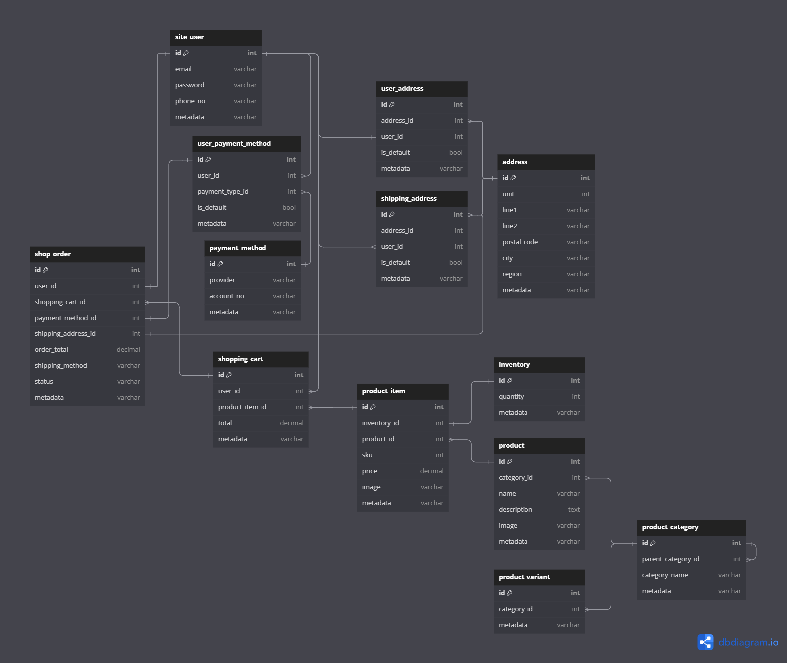

***The documentation for this ERD diagram is in early stagest of develoipment, pelase check again later.***

#### site_user
Authentication can be delegated to a separate tab/service.  
User has:
- Contact details
- Payment details
- Residency address
- Some delivery addresses

Additional metadata could include:
- Account creation timestamp
- Specific flags, etc.

#### product_item
Created as an instance of a generic **product** with a specific **product_category** that can self-join to create subcategories.  
**product_variant** represents a specific variant of a product.

#### shop_order
Has several tabs connected to it:
- `site_user`: Represents the user who placed the order.
- `shopping_cart`: Includes all the items selected to buy during this session.
- `payment_method`: Method used for payment.
- `shipping_address`: Address where the order will be shipped.
  
It selects a shipping method, calculates order total, and includes:
- Order status
- Metadata such as timestamp, specific flags, etc.

